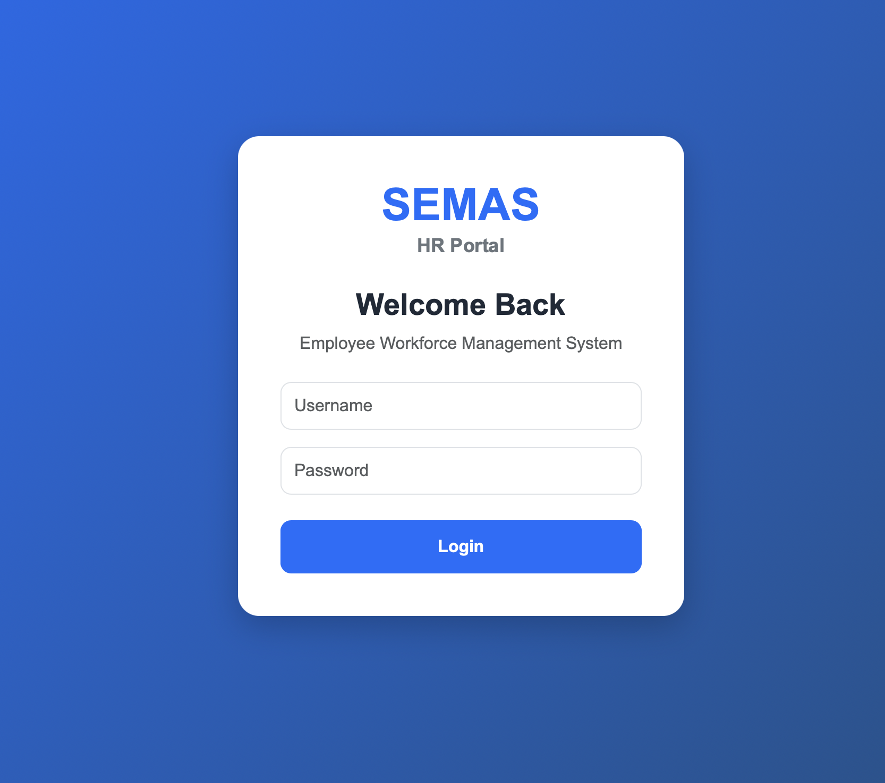
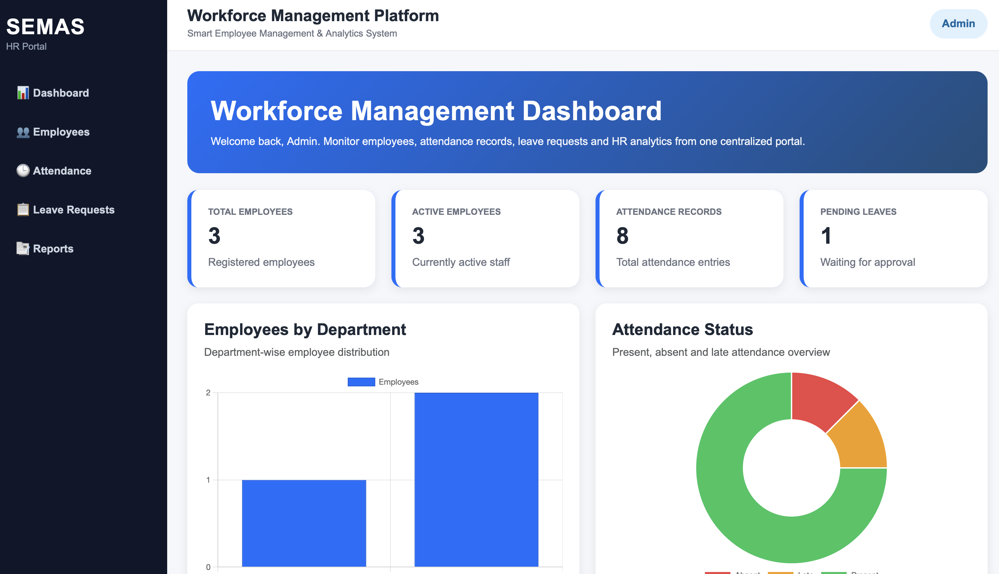
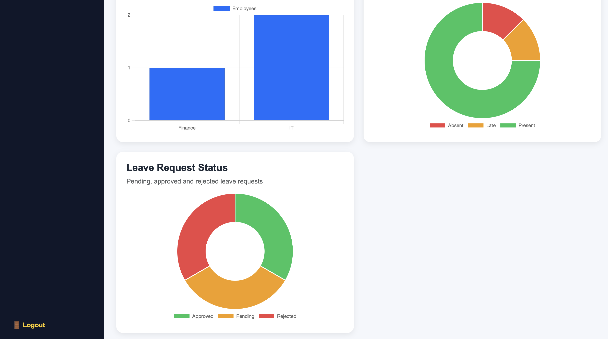
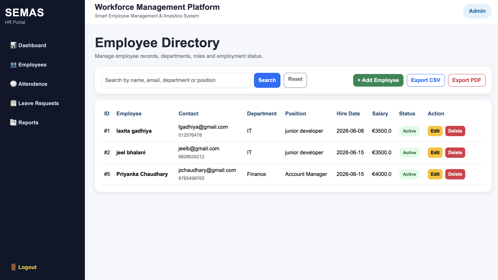
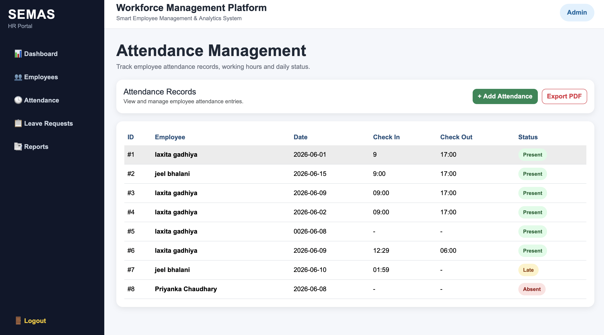
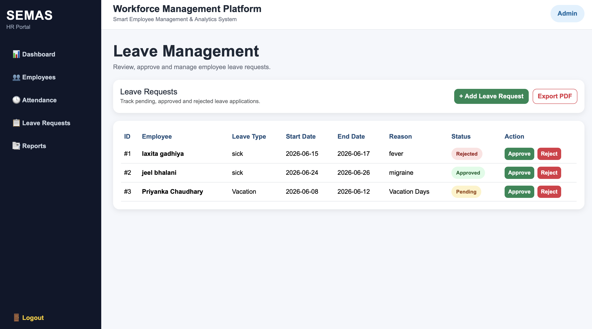
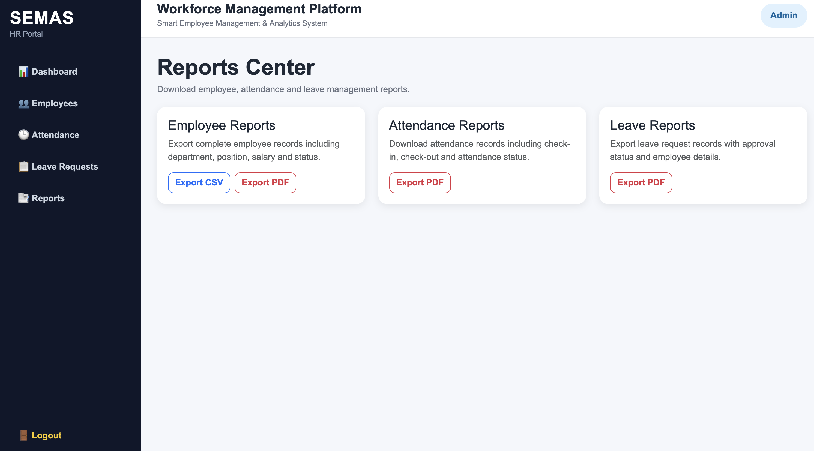

# Smart Employee Management & Analytics System (SEMAS)

SEMAS HR Portal is a full-stack employee management and HR analytics web application built using **Python, Flask, SQLite, Bootstrap, Chart.js, and ReportLab**.

The project is designed like a real company HR portal where an admin can manage employees, track attendance, manage leave requests, generate reports, and view workforce analytics from a professional dashboard.

---

## Project Overview

This application helps organizations manage employee records, attendance, leave requests, and reporting in one centralized system.

The project includes authentication, protected routes, employee CRUD operations, dashboard analytics, CSV/PDF exports, and a professional company-style UI with sidebar navigation.

---

## Features

### Authentication

* Admin login system
* Logout functionality
* Session-based protected routes

### Employee Management

* Add new employees
* View employee directory
* Edit employee details
* Delete employee records
* Search employees by name, email, department, or position
* Employee status badges
* Export employees to CSV
* Export employees to PDF

### Attendance Management

* Add attendance records
* View employee attendance
* Track check-in and check-out times
* Attendance status badges: Present, Absent, Late
* Export attendance report to PDF

### Leave Management

* Add leave requests
* View leave applications
* Approve leave requests
* Reject leave requests
* Leave status badges: Pending, Approved, Rejected
* Export leave report to PDF

### Dashboard Analytics

* Total employees
* Active employees
* Attendance records
* Pending leave requests
* Employees by department chart
* Attendance status chart
* Leave request status chart

### Reports Center

* Employee CSV report
* Employee PDF report
* Attendance PDF report
* Leave request PDF report

---

## Technologies Used

* Python
* Flask
* SQLite
* HTML5
* CSS3
* Bootstrap 5
* Jinja2
* Chart.js
* ReportLab

---

## Project Structure

```text
SEMAS-HR-Portal/
├── app.py
├── employee_system.db
├── requirements.txt
├── README.md
├── static/
│   └── style.css
├── templates/
│   ├── base.html
│   ├── login.html
│   ├── index.html
│   ├── employees.html
│   ├── add_employee.html
│   ├── edit_employee.html
│   ├── attendance.html
│   ├── add_attendance.html
│   ├── leave_requests.html
│   ├── add_leave_request.html
│   └── reports.html
└── screenshots/
    ├── login.png
    ├── dashboard_1.png
    ├── dashboard_2.png
    ├── employees.png
    ├── attendance.png
    ├── leave_requests.png
    └── reports.png
```

---

## Screenshots

### Login Page



### Dashboard Overview



### Dashboard Analytics



### Employee Directory



### Attendance Management



### Leave Management



### Reports Center



---

## How to Run the Project

### 1. Clone the repository

```bash
git clone https://github.com/YOUR_USERNAME/SEMAS-HR-Portal.git
```

### 2. Go to the project folder

```bash
cd SEMAS-HR-Portal
```

### 3. Install required packages

```bash
python3 -m pip install -r requirements.txt
```

### 4. Run the Flask application

```bash
python3 app.py
```

### 5. Open the application in browser

```text
http://127.0.0.1:5000
```

---

## Demo Login

```text
Username: admin
Password: admin123
```

---

## Database

The application uses **SQLite** as the database.

Database file:

```text
employee_system.db
```

Main tables:

* users
* employees
* attendance
* leave_requests

---

## Skills Demonstrated

This project demonstrates practical knowledge of:

* Python web development
* Flask routing and templates
* SQLite database integration
* CRUD operations
* Authentication and session management
* Dashboard analytics
* PDF and CSV report generation
* Responsive UI design
* Bootstrap-based admin dashboard design
* Jinja2 template inheritance
* Real-world HR system workflow

---

## Future Improvements

* Role-based access control for Admin and Employee users
* Employee profile photo upload
* Advanced filtering for reports
* Email notifications for leave approval/rejection
* Department-wise salary analytics
* Online deployment using Render or Railway
* PostgreSQL database upgrade

---

## Author

**Laxita Gadhiya**

This project was created as a portfolio project to demonstrate practical skills in Python, Flask, SQLite, web development, database management, reporting, authentication, and dashboard analytics.
